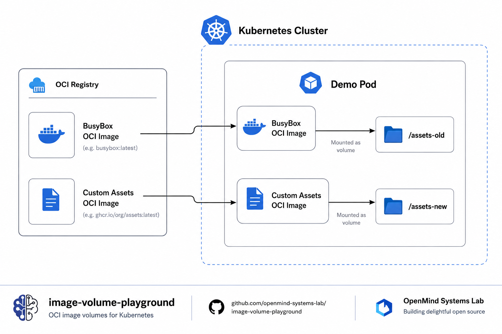

<p align="center">
  
</p>


<h1 align="center">Kubernetes Image Volume Playground</h1>

<p align="center">
A Proof of Concept demonstrating the new Image Volume feature introduced in Kubernetes. This repository shows how an OCI image can be mounted directly inside a Pod as a read-only filesystem, without running the image as a container.</p>

<p align="center">


</p>

---


# 📖 Overview

Kubernetes traditionally exposes application data through ConfigMaps, Secrets, Persistent Volumes or initContainers.

Starting with **Kubernetes v1.34**, a new volume source named **Image Volume** allows mounting the filesystem of an OCI image directly into a Pod.

Unlike a regular container image, the mounted image is **never executed**. Kubernetes simply extracts its filesystem and exposes it as a **read-only volume**.

This repository demonstrates how Image Volumes work using two OCI images:

- 📦 The official BusyBox image
- 📦 A custom OCI image containing application assets

The project is intended as a reproducible Proof of Concept for experimenting with this new Kubernetes capability.

---

# ✨ Why Image Volumes?

Before Image Volumes, distributing static application assets usually required one of several approaches.

| Solution | Advantages | Drawbacks |
|---|---|---|
| ConfigMap | Simple | 1 MiB limit |
| Secret | Secure | Not designed for large assets |
| Persistent Volume | Flexible | External storage required |
| initContainer | Very common | Additional startup time |
| Image Volume | OCI-native, immutable, versioned | Read-only |

Image Volumes combine several advantages:

✅ OCI distribution  
✅ Immutable content  
✅ Image caching  
✅ Registry versioning  
✅ No initContainer  
✅ No external storage  

---

# 🏗 Architecture



---

# 🧩 Components

| Component | Description |
|---|---|
| Namespace | Isolated playground |
| Demo Pod | Mounts two Image Volumes |
| BusyBox image | Reference OCI image |
| Assets image | Custom immutable assets |
| Dockerfile | Builds the custom OCI artifact |

---

# 🎯 Objective

The purpose of this repository is to demonstrate:

- Image Volume API
- OCI artifacts as data containers
- Immutable filesystem delivery
- Local experimentation using Kind
- Comparison with traditional Kubernetes volumes

---

# ⚙️ Prerequisites

Required tools:

- Kubernetes v1.34+
- Docker
- kubectl
- Kind

---

# ⚙️ Enable Image Volume Feature Gate

Image Volumes require the `ImageVolume` feature gate to be enabled on the kubelet.

For local experimentation, this repository uses Kind.

Create the cluster with the provided Kind configuration:

```bash
kind create cluster --config manifests/kind-image-volume.yaml 
```

The configuration enables:

```yaml
featureGates:
  ImageVolume: true
```

Without this feature gate, Kubernetes will reject Pods using:
```yaml
volumes:
- name: assets
  image:
    reference: example/image:v1
```

because the image volume source is not available.

---

# 🚀 Installation

## Build image

```bash
docker build -t my-assets:v1 assets-image
```

## Load image into Kind

```bash
kind load docker-image my-assets:v1 --name image-volume-lab
```

## Deploy

```bash
kubectl apply -f manifests/namespace.yaml
kubectl apply -f manifests/image-volume-demo.yaml
```

---

# 🔍 Verify Deployment

## Check the Pod

```bash
kubkubectl get pods -n image-volume-playground
```

## Describe the Pod

```bash
kubectl describe pod image-volume-demo -n image-volume-playground
```

---

# 🧪 Explore Image Volumes

Open a shell inside the Pod:

```bash
kubectl exec -it image-volume-demo -n image-volume-playground -- sh 
```

Browse the mounted OCI images:

```bash
find /assets-old

find /assets-new
```

Read packaged files:

```bash
cat /assets-new/assets/config.json
```

---

# 🖼 Expected Filesystem

```
/assets-old
│
├── bin
├── etc
├── usr
└── ...

/assets-new
│
└── assets
    ├── app.conf
    └── config.json
```

---

# ⚙️ How Image Volumes Work

Unlike a container image:

1. Kubernetes pulls the OCI image.
2. The kubelet extracts its filesystem.
3. The filesystem is mounted read-only.
4. No process is started.
5. No ENTRYPOINT is executed.

The volume behaves like any other read-only filesystem.

```
OCI Registry
      │
      ▼
 Image Pull
      │
      ▼
Filesystem Extraction
      │
      ▼
 Read-only Mount
      │
      ▼
     Pod
```

---

# 💡 Typical Use Cases

Image Volumes are particularly useful for distributing:

- 📚 Documentation
- 🌍 Static websites
- ⚙ Application configuration
- 🤖 AI models
- 📦 Machine learning datasets
- 🎨 Frontend assets
- 🗺 GIS resources
- 📖 Reference data

---

# ⚖ Comparison

| Feature | ConfigMap | PV | initContainer | Image Volume |
|---|---|---|---|---|
| Versioning | ❌ | ❌ | ⚠ | ✅ |
| OCI Registry | ❌ | ❌ | ⚠ | ✅ |
| Immutable | ⚠ | ❌ | ⚠ | ✅ |
| Large Assets | ❌ | ✅ | ✅ | ✅ |
| Read Only | ⚠ | ⚠ | ⚠ | ✅ |

---

# ⚠ Current Limitations

This feature is still relatively new.

Current limitations include:

- Read-only volumes
- Requires recent Kubernetes versions
- Feature availability depends on cluster configuration
- OCI image must already exist

---

# 🎓 What You Will Learn

After completing this playground you will understand:

✅ Image Volume internals  
✅ OCI artifact distribution  
✅ Immutable application assets  
✅ Kubernetes volume lifecycle  
✅ Differences with ConfigMaps and Persistent Volumes  

---

# 🧹 Cleanup

Delete Kubernetes resources:

```bash
kubectl delete -f manifests/image-volume-demo.yaml 
kubectl delete -f manifests/namespace.yaml        
```

Remove local image:

```bash
docker image rm my-assets:v1
```

Delete kind cluster:

```bash
kind delete cluster --name image-volume-lab
```


---

# 📚 References

- [Kubernetes Documentation](https://kubernetes.io/docs/)
- [OCI Image Specification](https://github.com/opencontainers/image-spec)
- [Kind (Kubernetes IN Docker)](https://kind.sigs.k8s.io/)
- [Docker Documentation](https://docs.docker.com/)

---

# 🏛 About OpenMind Systems Lab

OpenMind Systems Lab is an independent French non-profit association dedicated to research, experimental development and technical benchmarking in Cloud Native technologies.

Our mission is to produce practical, reproducible and educational Open Source Proofs of Concept covering Kubernetes, Platform Engineering, Distributed Messaging, Infrastructure Security and Artificial Intelligence.

GitHub Organization:

https://github.com/openmind-systems-lab

---

<p align="center">
Made with ❤️ by OpenMind Systems Lab
</p>